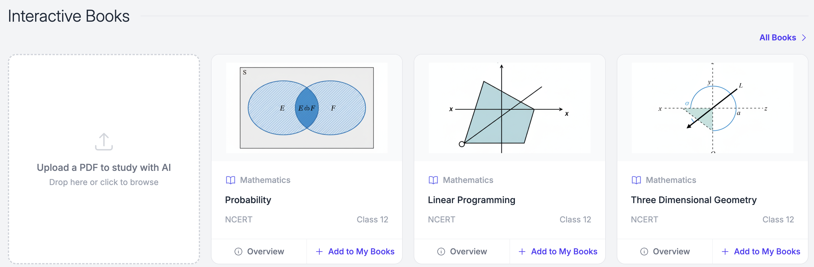
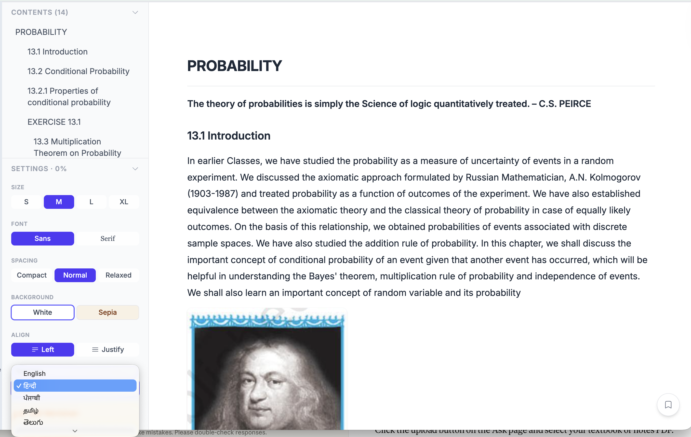
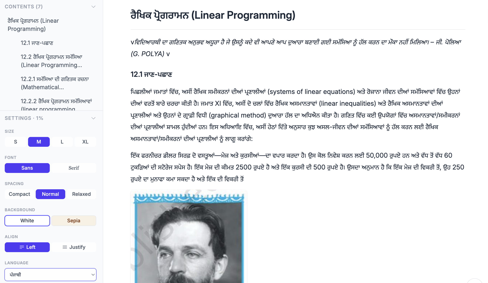
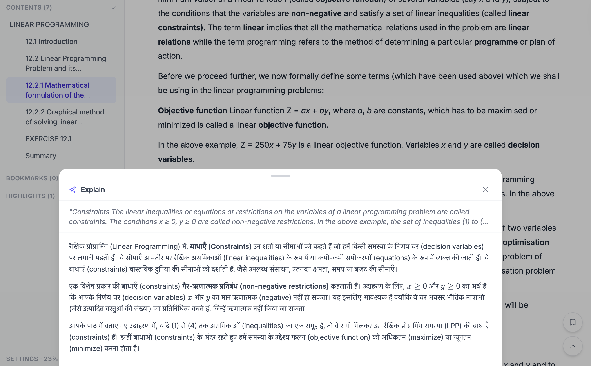
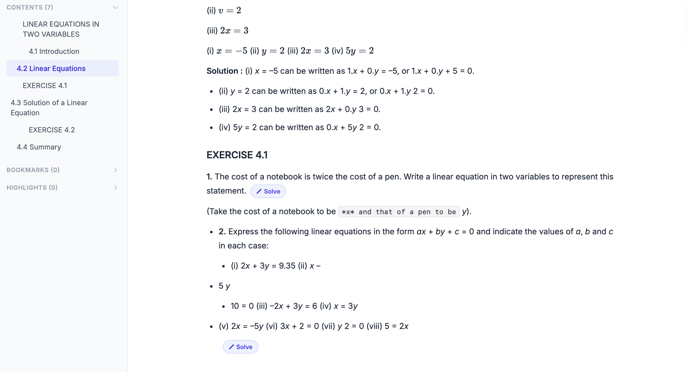

Most online edtech platforms give you pre-recorded videos. Most AI tools give you generic explanations. Neither knows your textbook, your board, or your language.

But your exam is not generic. Your teacher taught it a specific way. Your textbook has specific examples. Your board has a specific pattern.

**What if your AI tutor could learn directly from *your* book?**

That's exactly what [padho.ai](https://padho.ai) can do now.

---

## Quick Answers

**Can AI explain my textbook?**  
Yes. With [padho.ai](https://padho.ai) you can upload your textbook and it becomes a tutor for that specific book. You can highlight any paragraph for explanations, ask questions about concepts, and solve exercises step-by-step.

**Can I study my textbook in Hindi or another Indian language?**  
Yes. [padho.ai](https://padho.ai) supports 12 Indian languages — Hindi, Telugu, Tamil, Marathi, Bengali, Kannada, Malayalam, Gujarati, Punjabi, Odia, and Assamese. You can upload a book in English and get explanations in your preferred language.

**Can AI help me solve questions from my textbook?**  
Yes. [padho.ai](https://padho.ai) includes a Solve It feature for questions and examples in your book. Instead of giving the answer directly, it guides you through the solution step-by-step so you understand the reasoning.

**[Try it here → learn.padho.ai](https://learn.padho.ai)**

---

## How to Study a Textbook with AI

Students can now upload any PDF to [padho.ai](https://padho.ai) and learn directly from it. A school textbook, notes, a reference book — anything.

Once uploaded, [padho.ai](https://padho.ai) reads your book and becomes a tutor for that exact material.

You can:

- Ask doubts about any concept in the book
- Highlight any paragraph and get an instant explanation
- Solve any question from your book interactively, with step-by-step guidance
- Do all of this in **your preferred Indian language**

No more switching between your book and a separate tool. Everything happens in one place.

**[Upload your textbook and try it →](https://learn.padho.ai)**

---

## Study Any PDF Book Interactively

When you upload a PDF to [padho.ai](https://padho.ai), you can choose to study it in any of 12 Indian languages. Hindi, Telugu, Tamil, Marathi, Bengali, Kannada, Malayalam, Gujarati, Punjabi, Odia, Assamese, or English.

[padho.ai](https://padho.ai) doesn't just translate the book word by word. It explains the concepts in your language, using examples and phrasing that feel natural. The way a teacher from your city would explain it.

So a student in Bhopal studying from an English-medium CBSE textbook can now ask doubts and get explanations in Hindi. A student in Coimbatore can study the same chapter in Tamil.

Same book. Same concepts. Your language.

> **Why does this matter?**  
> When you already understand a concept in your language, learning the English terminology becomes much easier. You stop struggling with two things at once — the language and the subject.

---

## How It Works — Step by Step

### Step 1: Upload Your PDF or Pick From the Library

Go to the Interactive Books section on [padho.ai](https://padho.ai). You'll see an upload card on the left. Drag your PDF or click to browse. Popular NCERT content is also available directly if you want to start right away.

  
*Upload your own PDF or pick from available NCERT content*

### Step 2: Choose Your Language

Once your book is open, look for the **Language** option in the left panel. A dropdown appears with all 12 Indian languages. Select the one you think in.

  
*Pick your language from the left panel. You can change it anytime.*

### Step 3: Your Entire Book Renders in Your Language

Once you select a language, the whole experience shifts. The same Linear Programming chapter can be fully rendered in Punjabi — chapter title, table of contents, introduction, body text and every example in your language. Mathematical terms stay in English where needed but everything else is in your language.

  
*The same NCERT chapter, every word now in Punjabi*

### Step 4: Highlight Any Text and Get an Explanation

See a passage you don't understand? Select it. An **Explain** button appears. Tap it and a popup opens showing the original text at the top, then a full explanation in your language below.

Highlight a passage about constraints from the Linear Programming chapter and the explanation appears in Hindi (or your chosen language), breaking down what constraints mean with real examples. Your highlights are also saved automatically so you can revisit them anytime from the left panel.

  
*Select any text, tap Explain, and get a full breakdown in your language*

### Step 5: Solve Any Question Interactively

*Tap Solve on any question for step-by-step guidance in your language*

Any question or example in the book has a **Solve It** button. Tap it and instead of showing you the answer, [padho.ai](https://padho.ai) walks you through the solution step by step. It asks what you think the next step is, gives hints if you're stuck, and explains the why behind each step. All in your language.

---

## Why Studying in Your Mother Tongue Works Better

Research consistently shows that students understand complex concepts faster when explained in their native language. Once the concept is clear, learning the English terminology becomes much easier — because you're only dealing with one challenge at a time, not two.

[padho.ai](https://padho.ai) uses this principle. It helps students first understand the idea in their own language, then connects it to the formal terminology used in exams and textbooks.

**Before [padho.ai](https://padho.ai):** A student reads an example in English, copies it down, but isn't sure why certain steps work. They search YouTube for explanations but can't find one for their exact textbook. They ask a family member who studied in their language and struggles to explain in English.

**With [padho.ai](https://padho.ai):** They upload their textbook PDF, switch the language to Hindi (or their language), and the entire chapter renders in that language. They highlight a step they don't understand and [padho.ai](https://padho.ai) explains it in simple language. They tap Solve It on any exercise question and [padho.ai](https://padho.ai) walks them through it step by step, interactively. By the end, they've solved similar problems themselves.

The textbook didn't change. But how they interact with it did.

---

## Works With Any PDF

You don't need a special format or a specific publisher's book.

[padho.ai](https://padho.ai) works with:

- ✓ NCERT textbooks (all subjects, Class 6–12)
- ✓ State board textbooks
- ✓ Reference books (RD Sharma, HC Verma, etc.)
- ✓ Your own handwritten notes (scanned to PDF)
- ✓ Coaching material and study guides
- ✓ JEE / NEET / CUET / SSC / UPSC / GATE / CAT and other competitive exam material

If it's a PDF, you can upload it and start learning from it.

---

## Generic AI vs padho.ai

You might be thinking: *"Can't I just ask ChatGPT to explain something from my book?"*

Here's the difference:

| Generic AI | [padho.ai](https://padho.ai) with your PDF |
|------------|------------------------|
| Gives a general explanation | Explains exactly the method your book uses |
| Shows any approach | Follows your board's specific approach |
| Often directly answers | Guides you to the answer |
| English only (mostly) | Your language |
| No context of your syllabus | Knows exactly what you're studying |

When your exam is based on a specific textbook, learning from that specific textbook with a tutor who has read it makes a real difference.

---

## Frequently Asked Questions

**Q: Can AI explain my textbook?**  
Yes. With [padho.ai](https://padho.ai), you can upload your textbook and it becomes a tutor for that specific book. You can highlight any paragraph for explanations, ask questions about concepts, and solve exercises step-by-step.

**Q: How do I upload my textbook PDF to study with AI?**  
Go to [padho.ai](https://padho.ai), open Interactive Books, and click "Upload a PDF to study with AI." Once uploaded, [padho.ai](https://padho.ai) reads the book and helps you learn directly from it. It can explain passages, answer doubts, and guide you through solving questions from that exact book.

**Q: Can AI explain NCERT textbooks?**  
Yes. [padho.ai](https://padho.ai) works very well with NCERT textbooks and other school books. Upload the NCERT PDF and [padho.ai](https://padho.ai) can explain concepts, examples, and exercises step-by-step.

**Q: Can I study my textbook in Hindi or another Indian language?**  
Yes. [padho.ai](https://padho.ai) supports 12 Indian languages — Hindi, Telugu, Tamil, Marathi, Bengali, Kannada, Malayalam, Gujarati, Punjabi, Odia, and Assamese. You can upload a book in English and get all explanations in your preferred language.

**Q: Can AI help me solve questions from my textbook?**  
Yes. [padho.ai](https://padho.ai) includes a Solve It feature for questions and examples in your book. Instead of giving the answer directly, it guides you through the solution step-by-step so you understand the reasoning.

---

## Start Learning From Your Own Book

Your textbook is already the best study material for your exam. [padho.ai](https://padho.ai) just makes it interactive.

**How to get started:**

1. Go to [learn.padho.ai](https://learn.padho.ai)
2. Go to **Interactive Books**
3. Click **"Upload a PDF to study with AI"**
4. Choose your language
5. Start learning

**[Try it with your textbook →](https://learn.padho.ai)**

---

## Continue Exploring

If you found this useful, you may also like:

• [Learn in your mother tongue: padho.ai supports 12 Indian languages](/blog/multilingual-learning-12-indian-languages) — Doubt solving in the language you think in  
• [The stuck moment: why answers are not enough](/blog/the-stuck-moment-why-answers-are-not-enough) — Why guided thinking beats answers  
• [Rote learning vs conceptual learning: the difference parents can actually see](/blog/rote-learning-vs-conceptual-learning) — How to tell memorising from real understanding  
• [Why adaptive learning is the future of education](/blog/adaptive-learning-with-ai) — How personalised learning works at scale  

---

**About [padho.ai](https://padho.ai):** [padho.ai](https://padho.ai) is an AI-powered learning platform designed for Indian students, available in 12 Indian languages and aligned to CBSE, ICSE, and major state boards. Contact us at [reach@padho.ai](mailto:reach@padho.ai)
